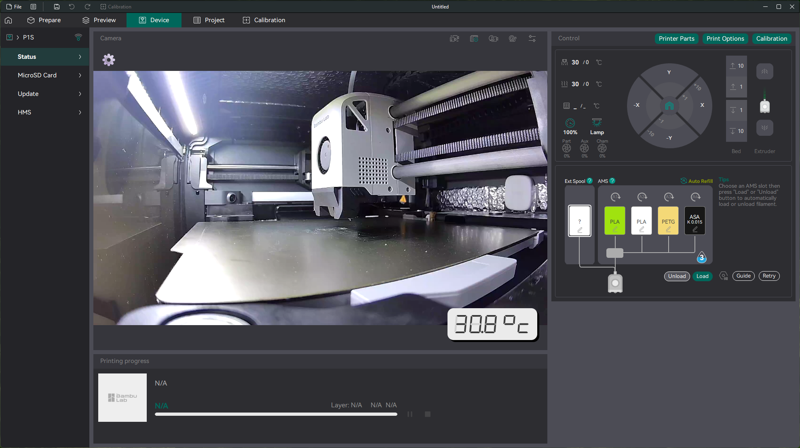

# Extrusion Peeper

Your printer camera shoots at 0.3fps 1mpx, preventing you from obsessing over every little detail of your printer extrusion? You like HOT print chambers at the tip of your fingers? Don't enjoy switching between three apps to monitor a print? Then this is for you!

On a more serious note, Extrusion Peeper does two things:

1. Relays RTSP LAN camera stream to a web page that you can plug into Orca Slicer.
2. Gives an optional overlay with a sensor temp.

# Why

Last year I bought my first printer - a P1S - and very quickly discovered how bad the stock camera was and how important chamber temp was important for filaments like ASA. I got whatever was available at my local hardware store - a Tapo C110 camera and a T310 sensor - and integrated into the slicer, all to a great success and utility. People expressed interest in a more polished solution than watching the stream with VLC, so I decided to share.

# How to

1. Get a Tplink/Tapo camera and set it up to stream over LAN. You'll need the camera host (like an IP - 192.168.1.20), camera login, and password.
2. Get a Tplink/Tapo temperature sensor and place it somewhere in the print chamber. To display temp alongside the video stream, you'll need to put your Tapo credentials into settings.
3. Install Node.js 24, clone this repo, cd into it and run `npm run start`. This will create a `settings.json` file - that's where you put the camera and sensor settings.
4. The app will print "You can now peep at extrusions over at: http://localhost:2024". Navigate to the link. If set up correctly and the camera is online, you'll observe the footage. For the sensor, click on the "Settings" button in the top-left corner, choose a sensor from the dropdown and click "Save".
5. To use with Orca, go to "Device", click on "Camera settings" in the top-right corner of the video section, enter "http://localhost:2024" (or whatever you have) into the address and press Enter.
6. Bonus: put the peeper into OS startup apps. It only consumes CPU for camera transcoding if you open the web page.

# Compatibility

These are devices that were confirmed to work:

## Cameras

1. Tapo C110.

## Temp sensors

1. Tapo T310
2. Tapo T315

## Slicer

1. Orca Slicer - works.
2. Bambu Studio - not compatible, there's no setting to set camera stream page URL.

# Contributions

These are very welcome, it's obvious I didn't pay much attention to how easy to use this is or whether it's compatible with many devices.

# Extras

1. [Awesome, clean mount for a C110 by HarryKlynn](https://makerworld.com/en/models/180019-p1p-p1s-tapo-c110-v2-internal-camera-mount)
2. [USB to 9v cable to power C110 from internal USB](https://www.aliexpress.com/item/1005005874548376.html?)
